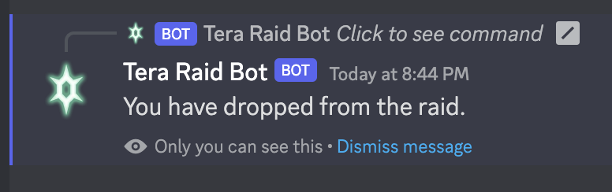

# Sicknarf's Tera Raid Bot

___

Welcome to to the Tera Raid Bot! To get started, click [here](https://discord.com/api/oauth2/authorize?client_id=1064068854071963698&permissions=2198888513521&scope=bot%20applications.commands) and add the bot to your server!

## setup guide

Once you've clicked the above link, there are a few simple steps to get full bot functionality onto your server. Click on the arrow icon for screenshot examples below.

1. Go to the server settings of your Discord.
    

2. Under `integrations`, look for `Sicknarf's Tera Raid Bot` and click `manage`.
    
3. Remove access to all channels, then add the channel you want to add the bot to.
    
4. Then, go into the channel settings of the channel that you've added the bot to.
    
5. Under `permissions`, click `Add members or roles`.
    
6. Add `Tera Raid Bot` to permitted members.
    
7. Then, expand `Advanced permissions`.
    
8. Make sure the following permissions are approved for Tera Raid Bot: ***this next step is imperative for bot function***
    - View Channel ***necessary to function***
    - Send Messages ***necessary to function***
    - Embed Links ***necessary to function***
    - Manage Messages ***necessary to function***
    - Use Application Commands ***necessary to function***
    - Read Message History ***necessary to function***
    - Send Messages in Threads (for future functionality)
    - Create Public Threads (for future functionality)
    - Create Private Threads (for future functionality)
    - Attach Files (for future functionality)
    - Add Reactions (for future functionality)
    - Use External Emoji (for future functionality)
    - Use External Stickers (for future functionality)
    - Mention `@everyone`, `@here`, and All Roles (for future functionality)
    - Manage Threads (for future functionality)

    

After that, you should be all set up and ready to use the bot!

___

## how to use

Once you are all set up, using it is pretty straightforward. Just start with `/host`.

1. Type `/host` to start the bot
    
2. Enter the Pokémon that you are raiding, the tera type, and how many stars this raid is.
    
3. The post has been made! If there is a chance of each flavor of Herba Mystica to drop, the post will be marked as such.
     
4. Other trainers can now click ✅ to join the raid! Once it is full, the button will become unclickable.
    
5. If someone changes their mind and can no longer do the raid, just click ⬅️, and this message will display:
    
6. Once you are ready (you don't need to wait for 4 people), click START and it will ping everyone to get ready! Then send over the link code!
    
7. If for any reason you can no longer start the raid, simply click 🛑.
    

If you are worried about non-hosts trying to start and cancel the raid, this has already been accounted for:

 

___

## about me

My name is Francis, and you can find me across the internet with variations of the username `sicknarf`. I'm a dev currently on the hunt for a job, so if you're enjoying the bot and need a jr. dev for some work, make sure to shoot me a message!

Here are my socials! [instagram](http://instagram.com/sicknarf/) | [twitch](http://twitch.tv/sicknarf) | [twitter](http://twitter.com/sick_narf)